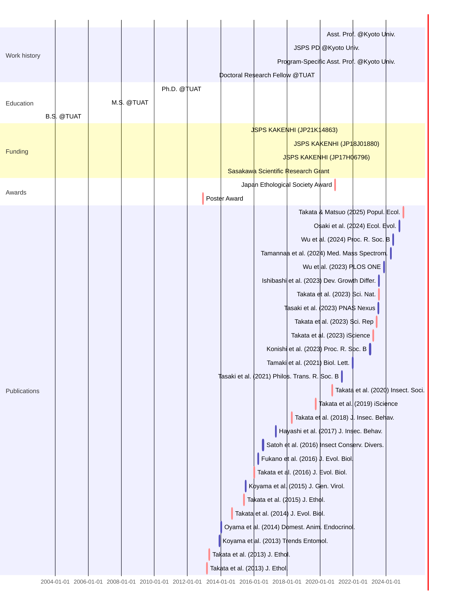

```mermaid
gantt
section Work history
  Asst. Prof. @Kyoto Univ.                      : active, Asst. Prof., 2020-04-01, 2026-03-31
  JSPS PD @Kyoto Univ.                          : active, PD, 2018-04-01, 2020-03-31
  Program-Specific Asst. Prof. @Kyoto Univ.     : active, Program-Specific Asst. Prof., 2017-04-01, 2018-03-31
  Doctoral Research Fellow @TUAT                : active, Program-Specific Asst. Prof., 2013-10-01, 2017-03-31

section Education
  Ph.D. @TUAT    : Ph.D., 2010-04-01, 2013-09-18
  M.S. @TUAT     : M.S., 2007-04-01, 2010-03-31
  B.S. @TUAT     : B.S., 2003-04-01, 2007-03-31

section Funding
  JSPS KAKENHI (JP21K14863)                     : active, grant_young, 2021-04-01, 2026-03-31
  JSPS KAKENHI (JP18J01880)                     : active, grant_PD, 2018-04-01, 2021-03-31
  JSPS KAKENHI (JP17H06796)                     : active, grant_start, 2017-08-01, 2018-03-31
  Sasakawa Scientific Research Grant            : active, grant_Sasagawa, 2014-04-01, 2015-03-31

section Awards
  Japan Ethological Society Award               : crit, aw_2, 2020-11-21, 2w
  Poster Award                                  : crit, aw_1, 2012-11-24, 2w

section Publications
  Takata & Matsuo (2025) Popul. Ecol.           : crit, Takata & Matsuo 2025, 2025-01-07, 2w
  Osaki et al. (2024) Ecol. Evol.               :       Osaki et al. 2024, 2024-10-17, 2w
  Wu et al. (2024) Proc. R. Soc. B              :       Wu et al. 2024, 2024-05-22, 2w
  Tamannaa et al. (2024) Med. Mass Spectrom.    :       Tamannaa et al. 2024, 2024-04-01, 2w
  Wu et al. (2023) PLOS ONE                     :       Wu et al. 2023, 2023-11-02, 2w
  Ishibashi et al. (2023) Dev. Growth Differ.   :       Ishibashi et al. 2023, 2023-07-18, 2w
  Takata et al. (2023) Sci. Nat.                : crit, Takata et al. 2023c, 2023-07-17, 2w
  Tasaki et al. (2023) PNAS Nexus               :       Tasaki et al. 2023, 2023-07-04, 2w
  Takata et al. (2023) Sci. Rep                 : crit, Takata et al. 2023b, 2023-05-31, 2w
  Takata et al. (2023) iScience                 : crit, Takata et al. 2023a, 2023-03-17, 2w
  Konishi et al. (2023) Proc. R. Soc. B         :       Konishi et al. 2023, 2023-01-04, 2w
  Tamaki et al. (2021) Biol. Lett.              :       Tamaki et al. 2021, 2021-12-22, 2w
  Tasaki et al. (2021) Philos. Trans. R. Soc. B :       Tasaki et al. 2021, 2021-04-26, 2w
  Takata et al. (2020) Insect. Soci.            : crit, Takata et al. 2020, 2020-09-22, 2w
  Takata et al. (2019) iScience                 : crit, Takata et al. 2019, 2019-09-27, 2w
  Takata et al. (2018) J. Insec. Behav.         : crit, Takata et al. 2018, 2018-04-14, 2w
  Hayashi et al. (2017) J. Insec. Behav.        :       Hayashi et al. 2017, 2017-04-29, 2w
  Satoh et al. (2016) Insect Conserv. Divers.   :       Satoh et al. 2016, 2016-07-16, 2w
  Fukano et al. (2016) J. Evol. Biol.           :       Fukano et al. 2016, 2016-04-01, 2w
  Takata et al. (2016) J. Evol. Biol.           : crit, Takata et al. 2016, 2016-01-01, 2w
  Koyama et al. (2015) J. Gen. Virol.           :       Koyama et al. 2015, 2015-07-01, 2w
  Takata et al. (2015) J. Ethol.                : crit, Takata et al. 2015, 2015-05-28, 2w
  Takata et al. (2014) J. Evol. Biol.           : crit, Takata et al. 2014, 2014-09-01, 2w
  Oyama et al. (2014) Domest. Anim. Endocrinol. :       Oyama et al. 2014, 2014-01-01, 2w
  Koyama et al. (2013) Trends Entomol.          :       Koyama et al. 2013, 2013-12-01, 2w
  Takata et al. (2013) J. Ethol.                : crit, Takata et al. 2015b, 2013-04-21, 2w
  Takata et al. (2013) J. Ethol.                : crit, Takata et al. 2015a, 2013-02-23, 2w
```
